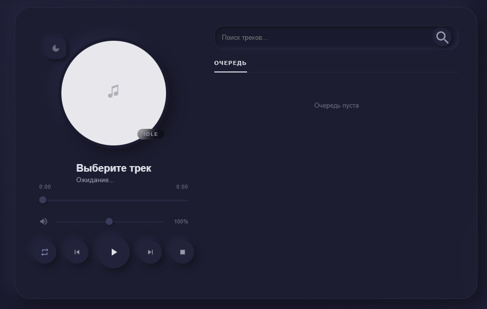
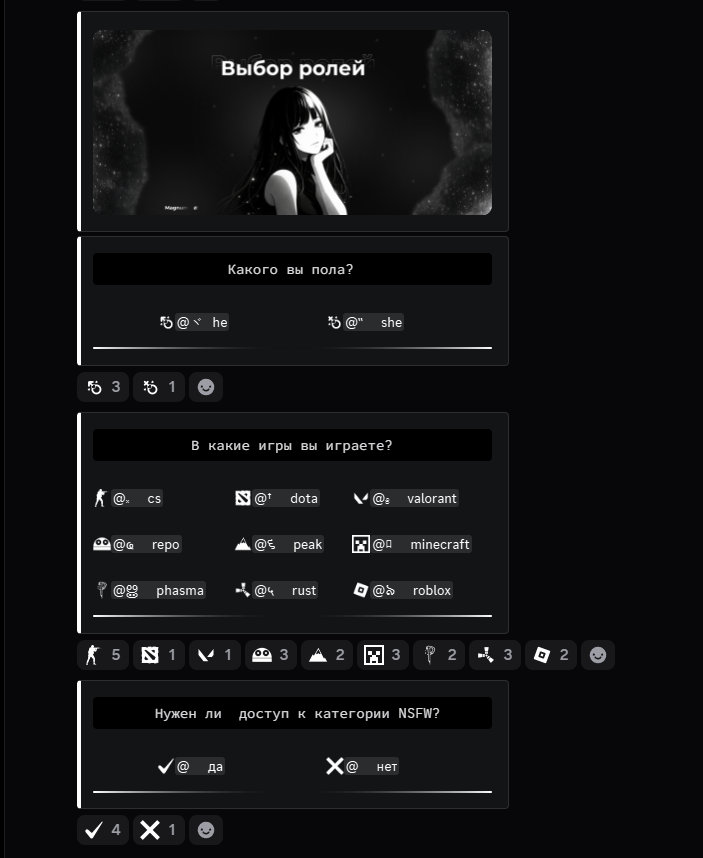

# 🤖 Magnum Bot — Advanced Discord Bot

<p align="center">
  
  
  
</p>

---

> [!IMPORTANT]
> **NOTE: This repository is a showcase.**
> It contains professional documentation and visual assets for the **Magnum Bot** project. The full source code is maintained in a private repository to protect intellectual property. This project demonstrates advanced backend architecture, concurrency management, and real-time graphics rendering using **Go**.

---

## 📖 Project Overview

Magnum Bot is a robust, modular Discord application designed for high-performance server management and user engagement. It features a custom-built economy engine, a sophisticated multiplayer minigames platform, and a real-time image processing system for user profiles.

## ✨ Technical Features and Capabilities

### 🖼️ Dynamic Visual Profiles
The bot features an advanced profile system that generates **high-quality personalized HD images** on-the-fly.
* **2D Rendering Engine:** Built natively using the `fogleman/gg` library.
* **Dynamic Data Injection:** Fetches live user statistics, Discord avatars, and social links, rendering them into a custom HD buffer.
* **Custom Typography:** Implements dynamic text alignment and custom TTF font rendering.

---

### 🎵 Music Activity (Discord Embedded)
A full-featured music player operating as a Discord Activity. ✨

* **⚡ Interface:** Minimalist and modern design.
* **🔍 Controls:** Instant track search and intuitive playback controls.
* **📜 Queue:** Simple playback queue management system.

<p align="center">
  
  <br><em>Sleek and modern Music Player interface.</em>
</p>

---

### 💰 Economy and Casino Ecosystem
A complete, transaction-safe economy solution with a rich interactive interface. 🎰

* **Games Suite:** Includes Mines (with cashout), Lucky Jet (Crash), Blackjack, Coinflip, and **Slots (3-reel and 5-reel)**.
* **Concurrency Control:** Uses strict `sync.Mutex` locks to ensure balance integrity during high-frequency gaming sessions.

---

### 🎮 Multiplayer Minigames & Scoring
A robust platform for both single-player and multiplayer sessions with a global ranking system. 🏆

* **Global Leaderboard:** A top-10 player ranking system powered by SQLite and GORM.
* **Featured Games:**
    * **🕵️‍♂️ Spy:** A social deduction game with hidden roles distributed via DMs and case-insensitive guessing.
    * **🔫 Russian Roulette:** Features real-time drum mechanics and turn-based PvP/AI modes.
    * **🕹️ Classics:** Fully interactive Tic-Tac-Toe and Hangman sessions.

---

### 🛡️ Core Reliability and UX

* **🎭 Reaction Roles:** A modular high-performance role distribution system via customized embed messages and server-side reaction listeners.
* **🧹 Role Hygiene:** An automated system for cleaning up level-up rewards, ensuring users maintain a clean profile with only their highest earned level.
* **🚀 Latency Resolution:** Optimized internal network routing via IPv4 (127.0.0.1) for zero-latency audio playback.

<p align="center">
  
  <br><em>Reaction Roles module with emoji-based selection.</em>
</p>

---

## 🏗️ Project Architecture

The project follows a clean, domain-driven structure to ensure maintainability:

```text
├── cmd/bot/                # Application entry point (main.go)
├── internal/
│   ├── config/             # Environment and configuration loaders
│   ├── database/           # SQLite connection and GORM Data Models
│   ├── modules/            # Core logic (Economy, Casino, Minigames)
│   └── utils/              # Helper services (Profiles, Staffmgr)
└── web/                    # Frontend assets for the web dashboard
```

## 🛠️ Tech Stack

* **Language:** Go (Golang) — chosen for its superior concurrency primitives.
* **🤖 API Wrapper:** Disgo.
* **💾 Database:** SQLite with GORM (Object-Relational Mapping).
* **🎨 Graphics:** fogleman/gg (Pure Go 2D rendering).
* **🎵 Audio:** Lavalink integration for high-quality streaming.

---

## 📬 Contact Information

* **GitHub:** [@mchbkv](https://github.com/mchbkv)
* **Discord:** `mchbkv`
* **Email:** [mchbkv@proton.me](mailto:mchbkv@proton.me)