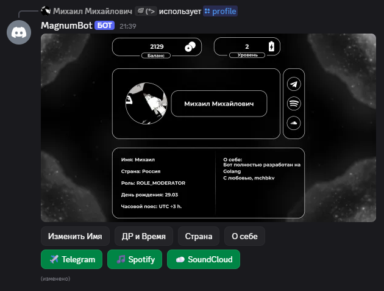
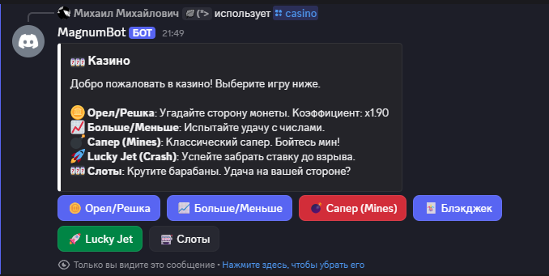
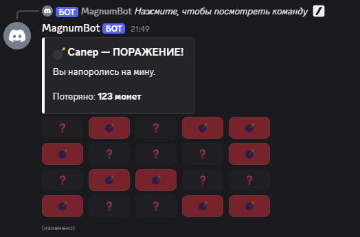
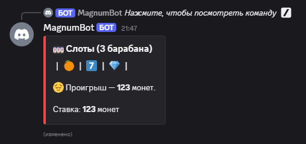
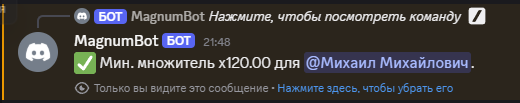
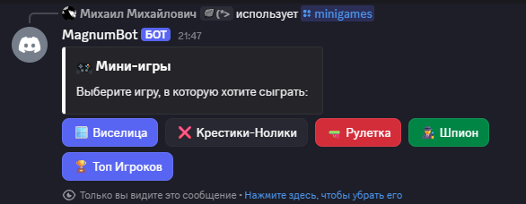
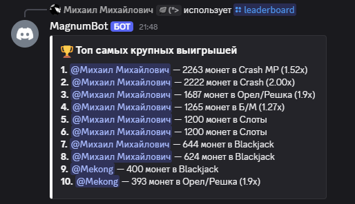
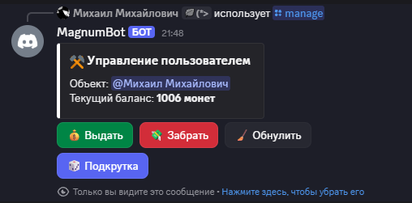

# 🤖 Magnum Bot — Advanced Discord Bot

<p align="center">
  
  
  
</p>

---

> [!IMPORTANT]
> **NOTE: This repository is a showcase.**
> It contains professional documentation and visual assets for the **Magnum Bot** project. The full source code is maintained in a private repository to protect intellectual property. This project demonstrates advanced backend architecture, concurrency management, and real-time graphics rendering using **Go**.

---

## 📖 Project Overview

Magnum Bot is a robust, modular Discord application designed for high-performance server management and user engagement. It features a custom-built economy engine, a sophisticated multiplayer minigames platform, and a real-time image processing system for user profiles.

---

## ✨ Features Showcase

### 🖼️ Dynamic Visual Profiles
The bot features an advanced profile system that generates **high-quality personalized HD images** on-the-fly.
* **2D Rendering Engine:** Built natively using the `fogleman/gg` library.
* **Dynamic Data Injection:** Fetches live user stats and avatars.

<p align="center">
  
  <br><em>Custom HD Profile rendering engine.</em>
</p>

---

### 💰 Economy & Casino Ecosystem
A transaction-safe economy solution with a rich interactive interface. Featuring strict `sync.Mutex` locks for data integrity.

<p align="center">
  
  
  <br>
  
  
</p>

* **Games Suite:** Mines (with cashout), Lucky Jet (Crash), Blackjack, and **Slots (3-reel & 5-reel)**.
* **Interactive Modals:** Real-time feedback and smooth interaction states.

---

### 🎵 Music Activity (Discord Embedded)
A full-featured music player operating as a Discord Activity with minimalist design. ✨

<p align="center">
  
</p>

* **⚡ Interface:** Instant track search and intuitive playback controls.
* **🚀 Zero Latency:** Optimized internal routing via 127.0.0.1.

---

### 🎮 Multiplayer Minigames & Systems
Robust platform for social interaction and ranking.

<p align="center">
  
  
</p>

* **Global Ranking:** SQLite/GORM powered Top-10 leaderboards.
* **Featured Games:** Spy, Russian Roulette, Tic-Tac-Toe, and Hangman.

---

### 🛡️ Server Management & Tools
Automated role distribution and server health utilities.

<p align="center">
  
  
</p>

* **🎭 Reaction Roles:** High-performance, modular role distribution.
* **🧹 Role Hygiene:** Automated cleanup of redundant level roles.

---

## 🏗️ Project Architecture

```text
├── cmd/bot/                # Application entry point (main.go)
├── internal/
│   ├── config/             # Environment and configuration loaders
│   ├── database/           # SQLite connection and GORM Data Models
│   ├── modules/            # Core logic (Economy, Casino, Minigames)
│   └── utils/              # Helper services (Profiles, Staffmgr)
└── web/                    # Frontend assets for the web dashboard
```

## 🛠️ Tech Stack

* **Language:** Go (Golang)
* **🤖 API Wrapper:** Disgo
* **💾 Database:** SQLite + GORM
* **🎨 Graphics:** fogleman/gg (Pure Go)
* **🎵 Audio:** Lavalink Integration

---

## 📬 Contact Information

* **GitHub:** [@mchbkv](https://github.com/mchbkv)
* **Discord:** `mchbkv`
* **Email:** [mchbkv@proton.me](mailto:mchbkv@proton.me)